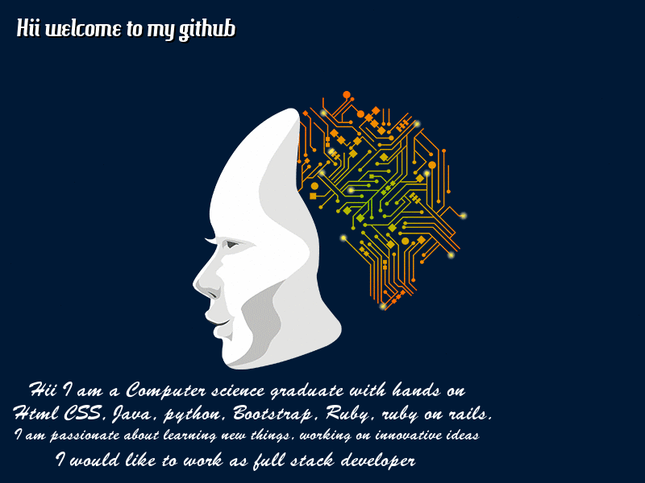

### 

- 📫 How to reach me: 
- GitHub: [@ShwetaSrivastava](https://github.com/vidhishweta01) - Twitter: [@ShwetaSrivastava](https://twitter.com/vidhishweta01) - LinkedIn: [ShwetaSrivastava](https://www.linkedin.com/in/vidhishweta01/)

       

 

 
